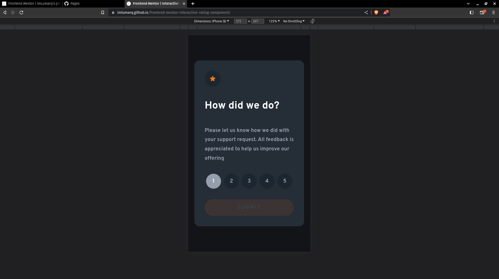
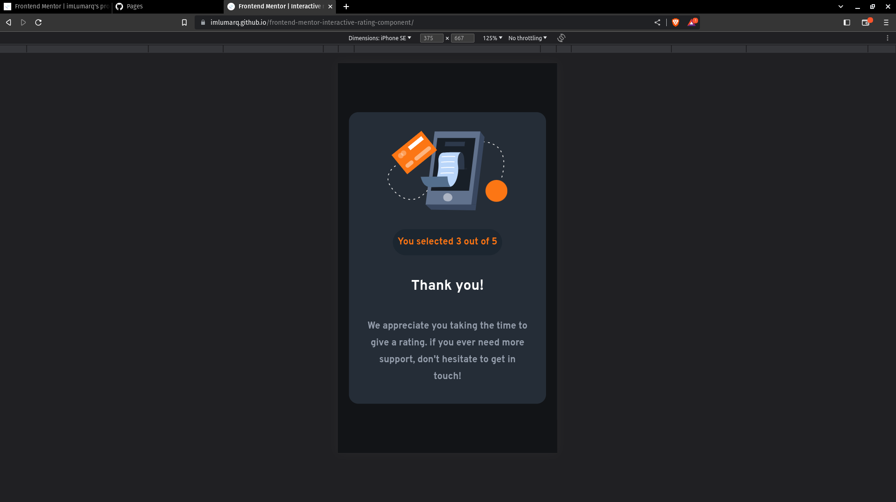
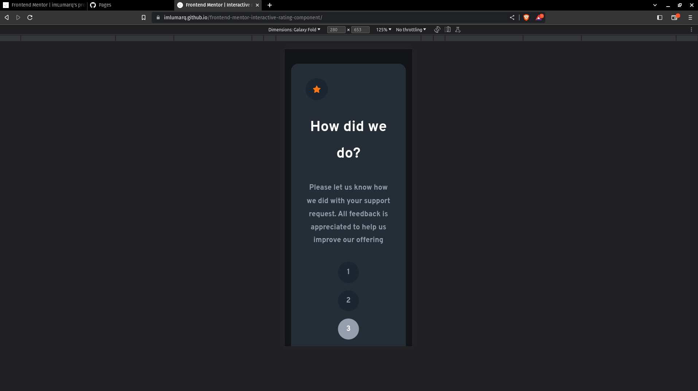
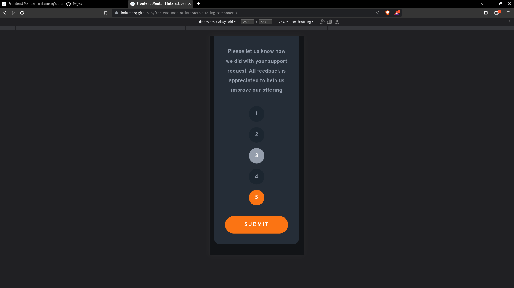
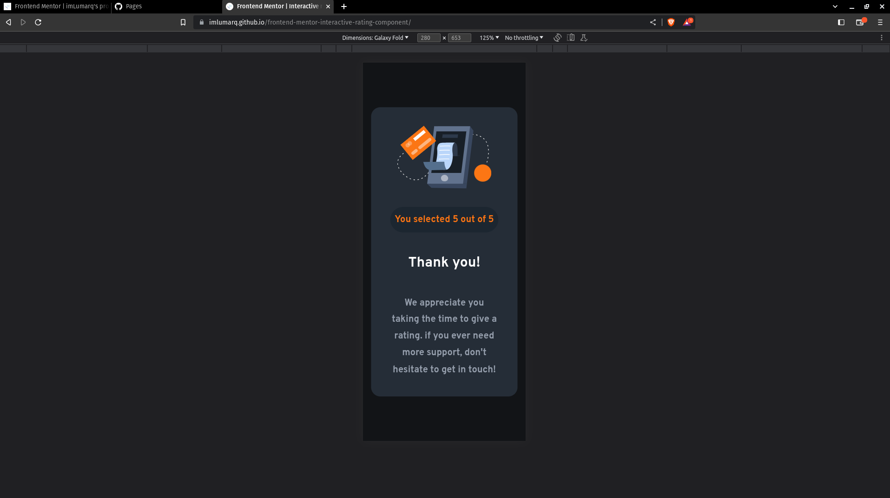

# Frontend Mentor - Interactive rating component solution

This is a solution to the [Interactive rating component challenge on Frontend Mentor](https://www.frontendmentor.io/challenges/interactive-rating-component-koxpeBUmI). Frontend Mentor challenges help you improve your coding skills by building realistic projects.

## Table of contents

-   [Overview](#overview)
    -   [Screenshot](#screenshot)
    -   [Links](#links)
-   [My process](#my-process)
    -   [Built with](#built-with)
-   [Author](#author)

## Overview

### The challenge

Users should be able to:

-   View the optimal layout for the app depending on their device's screen size
-   See hover states for all interactive elements on the page
-   Select and submit a number rating
-   See the "Thank you" card state after submitting a rating

### Screenshot

### Links

-   Live Site URL: (https://imlumarq.github.io/frontend-mentor-interactive-rating-component)
-   Github Repository: (https://github.com/imLumarq/frontend-mentor-interactive-rating-component)

## My process

### Built with

-   CSS custom properties
-   Semantic tags
-   Flexbox
-   Mobile-first workflow

## Author

-   Frontend Mentor - [@imLumarq](https://www.frontendmentor.io/profile/imLumarq)
